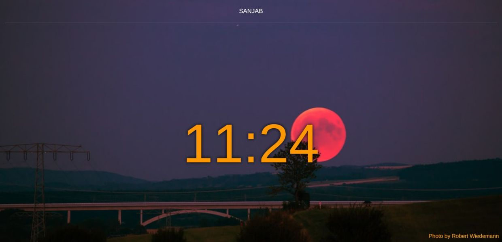

# Laravel admin panel

## [Installation](https://sanjabteam.github.io/install.html)
Read installation manual [here](https://sanjabteam.github.io/install.html).

### Changelog

Please see [CHANGELOG](CHANGELOG.md) for more information what has changed recently.

## Credits

- [Ace](https://ace.c9.io)
- [Agent](https://github.com/jenssegers/agent)
- [Bootstrap vue](https://bootstrap-vue.js.org)
- [Bouncer](https://github.com/JosephSilber/bouncer)
- [Browser logos](https://github.com/alrra/browser-logos)
- [Editor.js](https://editorjs.io)
- [ElFinder](https://github.com/Studio-42/elFinder)
- [ElFinder flysystem driver](https://github.com/barryvdh/elfinder-flysystem-driver)
- [ElFinder material theme](https://github.com/RobiNN1/elFinder-Material-Theme)
- [Google recaptcha](https://github.com/google/recaptcha)
- [Laravel](https://laravel.com)
- [Laravel package boilerplate](https://laravelpackageboilerplate.com)
- [Laravel translatable](https://github.com/Astrotomic/laravel-translatable)
- [Leaflet](https://leafletjs.com)
- [Flysystem](https://github.com/thephpleague/flysystem)
- [Material dashboard](https://github.com/creativetimofficial/material-dashboard)
- [Material design icons](https://github.com/google/material-design-icons)
- [Notification Sound](https://www.zedge.net/ringtone/ecd91e5b-802b-3b88-834d-67c2f4534c5d)
- [Open street map](https://www.openstreetmap.org)
- [Orchestral testbench](https://github.com/orchestral/testbench)
- [QS](https://github.com/ljharb/qs)
- [Quill](https://quilljs.com)
- [Shabnam font](https://github.com/rastikerdar/shabnam-font)
- [Tus](https://tus.io)
- [Tus php](https://github.com/ankitpokhrel/tus-php)
- [Unsplash](https://unsplash.com)
- [Uppy](https://uppy.io)
- [V-money](https://github.com/vuejs-tips/v-money)
- [Vue.js](https://vuejs.org)
- [Vue bootstrap typeahead](https://github.com/alexurquhart/vue-bootstrap-typeahead)
- [Vue editor.js](https://github.com/changjoo-park/vue-editor-jse)
- [Vue quill editor](https://github.com/surmon-china/vue-quill-editor)
- [Vue select](https://github.com/sagalbot/vue-select)
- [Vue tags input](https://github.com/voerro/vue-tagsinput)
- [Vue2 leaflet](https://github.com/KoRiGaN/Vue2Leaflet)

## License

The MIT License (MIT). Please see [License File](LICENSE.md) for more information.
