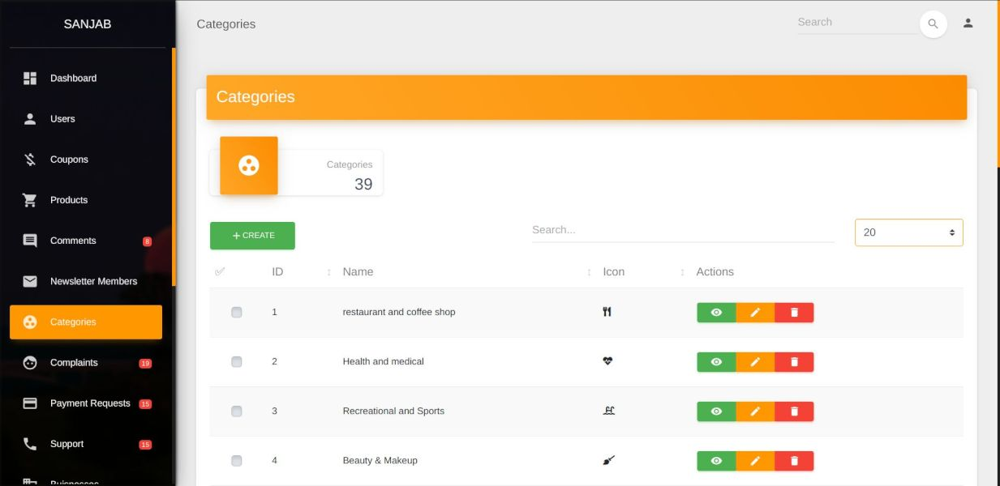
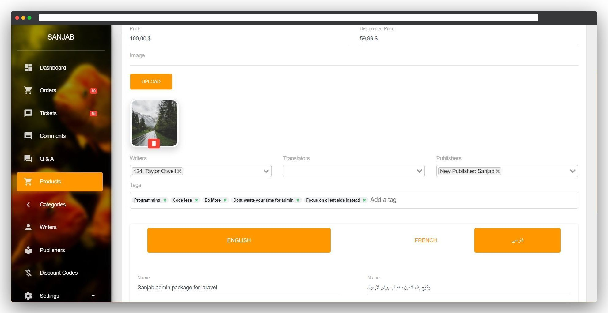
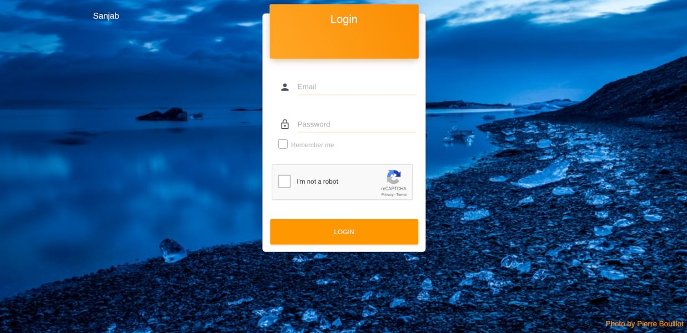
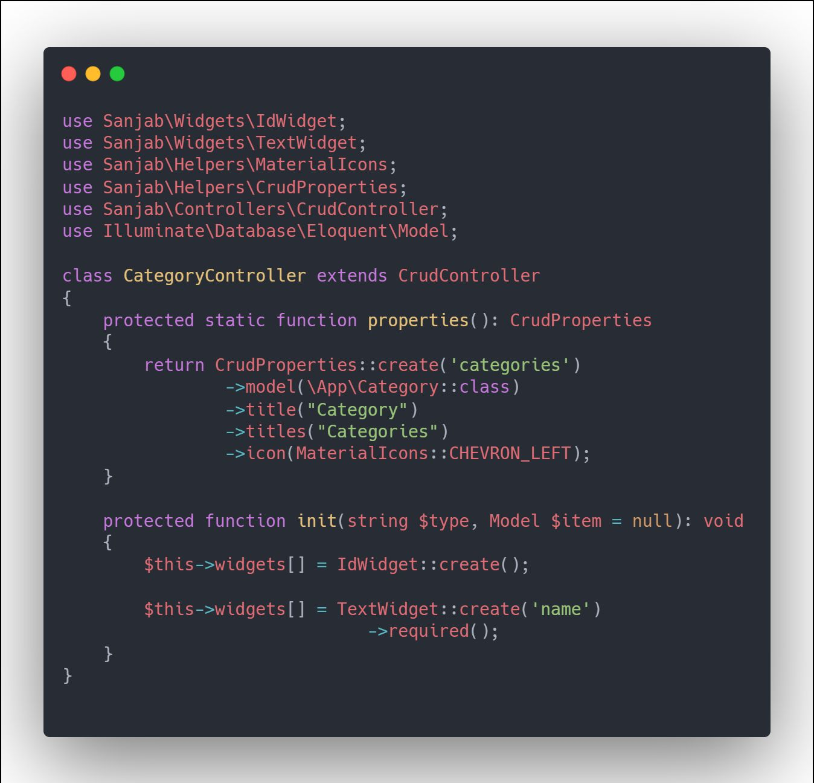

<div align="center">
    
</div>
<h1 align="center">Sanjab</h1>
<h2 align="center">Admin panel package for Laravel</h2>

<div align="center">

[](https://travis-ci.com/sanjabteam/sanjab)
[](https://github.styleci.io/repos/197559365)
[](https://www.codefactor.io/repository/github/sanjabteam/sanjab/overview/master)
[](https://codecov.io/gh/sanjabteam/sanjab)
[](https://packagist.org/packages/sanjabteam/sanjab)
[](https://packagist.org/packages/sanjabteam/sanjab)
[](https://opensource.org/licenses/MIT)
[](https://discord.gg/kwuTZQd)

</div>

> I do not recommend to using this package anymore. Recommended package: [litstack](https://github.com/litstack/litstack)

Sanjab is a [Laravel](http://laravel.com/) package that helping Laravel developers create an admin panel for projects quickly.

- [Screebshots](#screebshots)
- [Features](#features)
- [Getting Started](#getting-started)
- [Code](#code)
- [Documentation](#documentation)
- [Community & Support](#community--support)
- [Acknowledgements](#acknowledgements)
- [Changelog](#changelog)
- [License](#license)


---

## Screebshots




---

## Features
* Easy yet powerful.
* Working directly with [Eloquent](https://laravel.com/docs/eloquent) models.
* Eloquent relation & policy support.
* Multiple [input types](https://sanjabteam.github.io/widgets.html) and [cards](https://sanjabteam.github.io/cards.html).
* [Setting](https://sanjabteam.github.io/setting.html) support with no pain.
* Extendible. [Create a custom field](https://sanjabteam.github.io/widgets.html#extending-widgets) or completely custom controller based on [vue.js](https://vuejs.org/).
* Dynamic Role/Permission support based on [bouncer](https://github.com/JosephSilber/bouncer).
* Customizable CRUD buttons and bulk actions support in few lines of code.
* Multilingual inputs support based on [laravel translatable](https://github.com/Astrotomic/laravel-translatable).
* Realtime notification tracking with toast and/or sound notification support.
* Beautiful Material UI based on [Material Dashboard](https://www.creative-tim.com/product/material-dashboard).

## Getting Started
First, you should install sanjab on your Laravel project. Read installation guide here [Here](https://sanjabteam.github.io/install.html).

## Code
Sanjab has an elegant syntax.

For example, if you have a field called "name" in your model and it's a required field. you can define text field for that just in a few lines of code:
```php
$this->widgets[] = TextWidget::create('name')
                ->required();
```
Now you have a field in your create/edit form, table column with search, sort support and show field, all done automatically.



Also autocomplete is supported for your favorite IDE.

## Documentation
You can find more information about Sanjab in [documentation](https://sanjabteam.github.io/).

## Community & Support
Join us on [Discord](https://discord.gg/kwuTZQd).

To ask a question read [Support Guide](./.github/SUPPORT.md).

## Acknowledgements

- [Ace](https://ace.c9.io)
- [Agent](https://github.com/jenssegers/agent)
- [Axios](https://github.com/axios/axios)
- [Bootstrap vue](https://bootstrap-vue.js.org)
- [Bouncer](https://github.com/JosephSilber/bouncer)
- [Browser logos](https://github.com/alrra/browser-logos)
- [Carbon](https://github.com/briannesbitt/carbon)
- [Chart.js](https://www.chartjs.org/)
- [Editor.js](https://editorjs.io)
- [ElFinder](https://github.com/Studio-42/elFinder)
- [ElFinder flysystem driver](https://github.com/barryvdh/elfinder-flysystem-driver)
- [ElFinder material theme](https://github.com/RobiNN1/elFinder-Material-Theme)
- [Font Awesome](https://github.com/FortAwesome/Font-Awesome)
- [Google recaptcha](https://github.com/google/recaptcha)
- [Laravel](https://laravel.com)
- [Laravel package boilerplate](https://laravelpackageboilerplate.com)
- [Laravel translatable](https://github.com/Astrotomic/laravel-translatable)
- [Leaflet](https://leafletjs.com)
- [Flysystem](https://github.com/thephpleague/flysystem)
- [Material dashboard](https://github.com/creativetimofficial/material-dashboard)
- [Material design icons](https://github.com/google/material-design-icons)
- [Notification Sound](https://www.zedge.net/ringtone/ecd91e5b-802b-3b88-834d-67c2f4534c5d)
- [Open street map](https://www.openstreetmap.org)
- [Opis Closure](https://github.com/opis/closure)
- [Orchestral testbench](https://github.com/orchestral/testbench)
- [QS](https://github.com/ljharb/qs)
- [Quill](https://quilljs.com)
- [Quill ImageUpload Module](https://github.com/fxmontigny/quill-image-upload)
- [PHPUnit](https://github.com/sebastianbergmann/phpunit)
- [Shabnam font](https://github.com/rastikerdar/shabnam-font)
- [Sweetalert2](https://github.com/sweetalert2/sweetalert2)
- [Tus](https://tus.io)
- [Tus php](https://github.com/ankitpokhrel/tus-php)
- [Unsplash](https://unsplash.com)
- [Uppy](https://uppy.io)
- [V-money](https://github.com/vuejs-tips/v-money)
- [Vue.js](https://vuejs.org)
- [Vuex](https://vuex.vuejs.org)
- [Vue bootstrap typeahead](https://github.com/alexurquhart/vue-bootstrap-typeahead)
- [Vue Chart.js](https://github.com/apertureless/vue-chartjs)
- [Vue-date-time](https://github.com/mariomka/vue-datetime)
- [Vue Draggable](https://github.com/SortableJS/Vue.Draggable)
- [Vue editor.js](https://github.com/changjoo-park/vue-editor-js)
- [Vue quill editor](https://github.com/surmon-china/vue-quill-editor)
- [Vue select](https://github.com/sagalbot/vue-select)
- [Vue tags input](https://github.com/voerro/vue-tagsinput)
- [Vue2 leaflet](https://github.com/KoRiGaN/Vue2Leaflet)

## Changelog

Please see [CHANGELOG](CHANGELOG.md) for more information about what has changed recently.

## License

The MIT License (MIT). Please see [License File](LICENSE.md) for more information.
